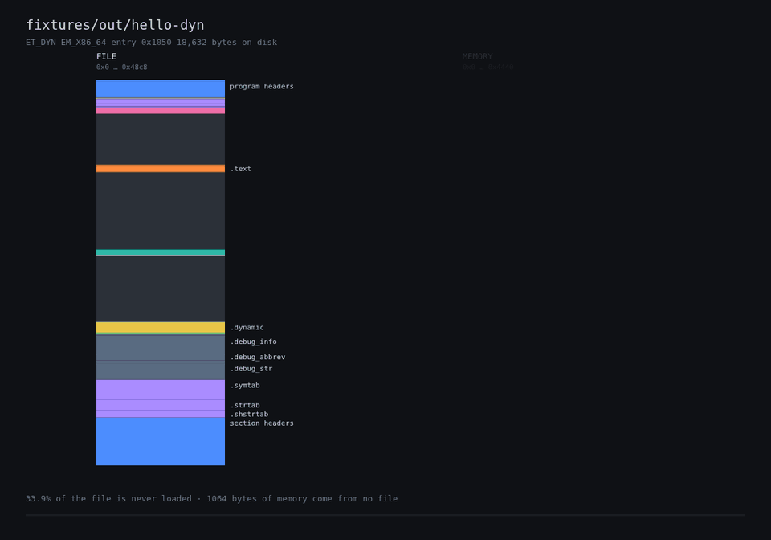
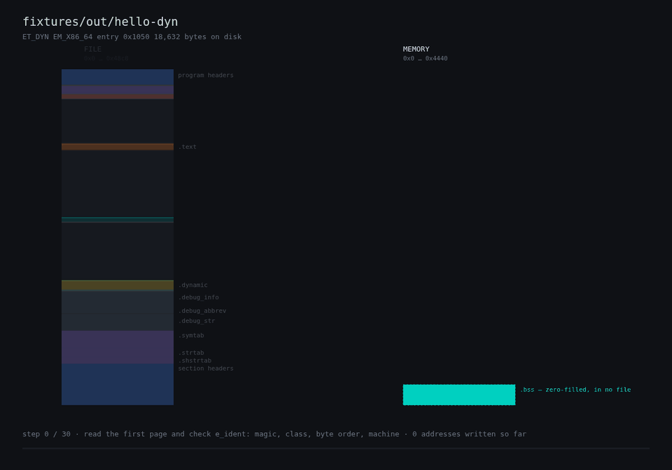

# elf-anatomy

**Watch a binary become a process.**



On the left, an 18KB hello-world as it sits on disk. On the right, the same bytes at the
addresses the kernel maps them to. Bands that are loaded slide across. Bands that are
not — the symbol table, the debug info, the section headers — stay where they are and
fade, because nothing ever reads them. `.bss` grows on the right out of nothing, since it
is in `p_memsz` and in no file at all.

Three numbers fall out of that picture, none of which `readelf` will tell you:

- **33.9% of the file never becomes part of the process.**
- **22% of it exists twice** — the read-only and read-write segments share a file page, so
  the kernel maps that page at two addresses with two different protections.
- Stripped, `/bin/ls` is only **1.3%** unexplained. Same format, different answer.

## The load, step by step



The kernel maps four segments and zero-fills `.bss`. `ld.so` relocates itself, resolves
`DT_NEEDED`, then applies relocations table by table — each yellow tick is one address
being written. `PT_GNU_RELRO` seals the GOT read-only (watch the stripe beside the column
change colour), initialisers run, and control transfers to `_start`.

Every step is derived from the file:

```console
$ elfa steps fixtures/out/relr
      13  DT_RELR: 5 relocations
      14  write 0x3d98: R_X86_64_RELATIVE
      ...
      26  DT_JMPREL: 1 relocation — lazy, so nothing is written yet
      27  mprotect 0x3000..0x4000 read-only — PT_GNU_RELRO: the GOT is sealed
      29  run DT_INIT_ARRAY at 0x3d98: 2 initialisers
      30  transfer control to 0x1050: _start → __libc_start_main → main
      31  first call through each PLT stub traps into _dl_runtime_resolve
```

## Is any of that true?

That is the part most tools skip. This one runs the program under `LD_DEBUG`, stops it
twice under gdb, and diffs what the model claimed against what the loader did:

```console
$ elfa diff /bin/ls
  ok    mappings               6 vmas, identical base-relative
  ok    DT_NEEDED              2 resolved: libselinux.so.1, libc.so.6
  ok    relocation order       3 object(s) relocated before the program
  ok    initialiser order      program last, after 4
  ok    binding mode           BIND_NOW — PLT relocations applied before main
  ok    symbol binds           all 121 named by relocations were bound; the loader resolved 6 more of its own
```

The model reproduces the kernel's mapping table exactly — addresses, protections, file
offsets, VMA boundaries — for every fixture and for `/bin/true` and `/bin/ls`. Where the
model claims nothing, the check says `--` rather than passing silently.

Ten or so real errors came out of that comparison rather than out of tests, and several of
them were wrong in the flattering direction. They are all written up in
[docs/CONFORMANCE.md](docs/CONFORMANCE.md) — the RELRO rounding direction, `mprotect`
splitting rather than recolouring a mapping, three separate corrections to the VMA merge
rule, and a `.bss` mapping the diff was silently dropping.

## Use

```sh
cargo build --release
./target/release/elfa verify /bin/ls
```

| | |
|---|---|
| `elfa verify <file>` | check every byte is accounted for, list what nothing explains |
| `elfa dump <file>` | the claim tree, structure by structure |
| `elfa at <file> <off>` | what covers this byte, innermost first |
| `elfa map <file>` | what the kernel maps, and what it leaves behind |
| `elfa morph <file>` | the file→memory animation as SVG frames |
| `elfa steps <file>` | the modelled load, step by step |
| `elfa trace <file>` | run it and record what the real loader did |
| `elfa diff <file>` | check the model against that recording |

`scripts/render-gif.sh <file> morph|steps` turns the frames into the animations above.

> **`elfa trace` and `elfa diff` execute the binary.** They are the only commands that do;
> everything else just reads bytes. Do not point them at something you would not run.

## How it works

**Every byte of the file is claimed by exactly one leaf.** Structures nest freely — the
ELF header claim contains its own `e_entry` field claim — but the leaves form an exact
partition, and the parser refuses to produce anything else.

That invariant is both the correctness test and the source of the interesting output. An
overlap means a size calculation is wrong. And whatever is left over is, by construction,
the part no structure explains: page-alignment padding, linker gaps, appended data. The
findings above were not looked for. They are the remainder.

The parser is hand-written rather than built on `object` or `goblin`. Those crates give
you the decoded meaning and discard the offsets, which is the right design for a linker
and the wrong one here — the offsets are the product. Reads are bounds-checked and
endian-aware, every offset goes through `try_from`, and the crate is `no_std` and forbids
`unsafe`.

## Scope

x86-64 ELF64 little-endian. The timeline models the main object: dependencies are named as
they resolve but not themselves mapped or relocated. `elfa trace` needs glibc, since
`LD_DEBUG` is a glibc feature, and Linux, since it reads `/proc`.

## Documentation

| | |
|---|---|
| [docs/MODEL.md](docs/MODEL.md) | The step list, phase by phase, and what is out of scope |
| [docs/CONFORMANCE.md](docs/CONFORMANCE.md) | Every place the model and a real `ld.so` disagreed |
| [docs/FORMAT-NOTES.md](docs/FORMAT-NOTES.md) | What the specimens taught us that the spec does not say plainly |
| [docs/RENDERING.md](docs/RENDERING.md) | Why the renderer is headless first |

## License

MIT OR Apache-2.0
